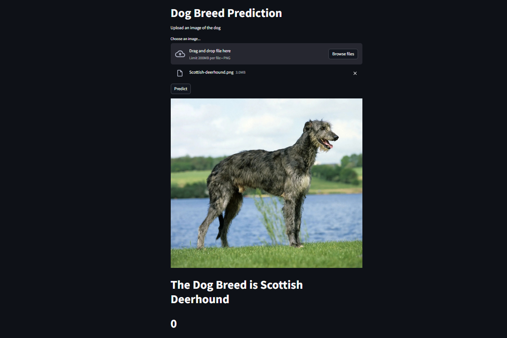

# Dog Breed App

## Table of Contents

- [Project Overview](#project-overview)
- [Installation](#installation)
- [Usage](#usage)

## Project Overview
This project aims to detect dog breed name using machine learning techniques. 

## Installation
1. Clone this repository
2. Navigate to the project directory:
cd deploy-streamlit-app
3. Install the required dependencies:
   pip install numpy keras opencv-python streamlit 

## Usage

1. Run the streamlit app in terminal: `streamlit run main-app.py`
2. Upload the image of dog you want to predict
3. Click on predit

